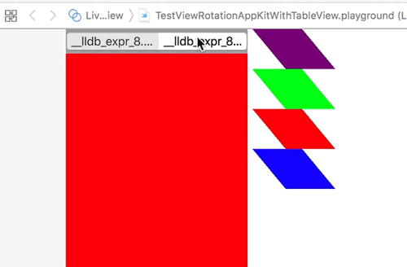

# Layer based rotation in a tableview

Must be some sequencing issue or something. When the tableview displays
already, all seems good.
If it is wrapped in a tabview and shown later, things fall apart.

